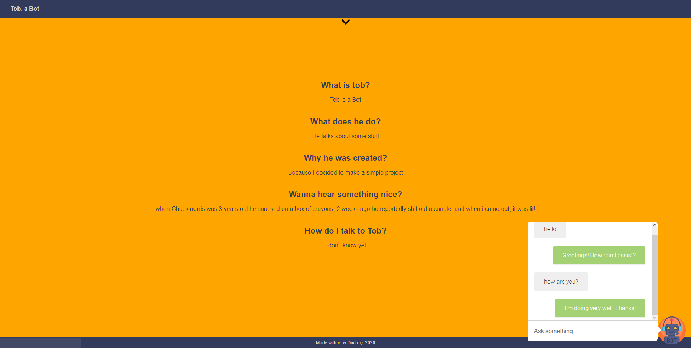

# [tob-a-bot](https://tob-a-bot.herokuapp.com/)

This is Tob, a simple Bot.

## The project





## Talk with Tob

Through the website:

[tob-a-bot.herokuapp.com](https://tob-a-bot.herokuapp.com/)

On Telegram:

[t.me/Tob_a_bot](https://t.me/Tob_a_bot)


## Tech
- [Node.JS](https://pugjs.org/api/getting-started.html): Server framework.
- [ExpressJS](https://expressjs.com): Back end web application framework for Node.js.
- [Pug](https://pugjs.org/api/getting-started.html): Template Engine.


## Useful commands
Download dependencies:
```console
> yarn install
```

Start a local server:
```console
> yarn start
```

Start a local server restarting automatically when files update:
```console
> yarn dev
```